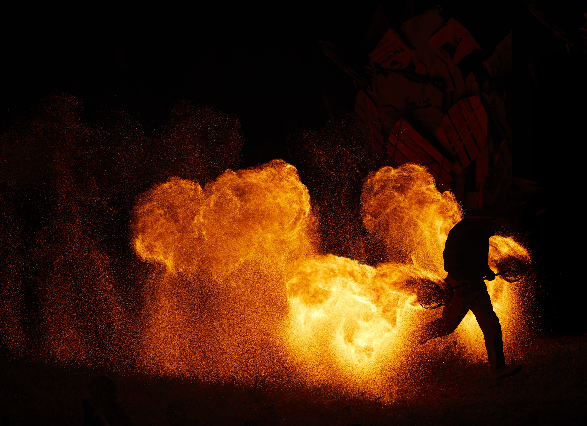

# BURNS {-}

*crédits : Andrew Miller - https://www.awesomephotography.ca/*

<h2>EFFIGIE & TEMPLE</h2> 

La cérémonie du Burn de l’Effigie est prévue le samedi au coucher du soleil. 

Le Temple est un espace intentionnel de co-création. Une équipe de bénévoles a construit un monument qui servira de canevas libre pour notre délivrance collective. Au cours de l'événement, les OsstidBurners peuvent écrire des messages, laisser des souvenirs, passer un moment dans le calme, se livrer à une cérémonie, ou tout ce qui a une signification pour elleux dans le but de commémorer les choses dont iels aimeraient se défaire. Si ce n'est pas ton truc, pas de problème. Veuillez toutefois traiter cet espace et les objets personnels et importants qui s'y trouvent avec respect. Si vous restez jusqu'à la fin de l'événement, vous aurez le privilège de vivre l'expérience du Burn du Temple, au cours duquel nous observons, en tant que communauté, l'acte transformateur de brûler tout ce que nous sommes prêt.e.s à laisser derrière nous. La cérémonie du Burn du Temple est prévue le dimanche au coucher du soleil. 

Si vous souhaitez participer au périmètre de sécurité du Burn de l’Effigie ou du Temple, inscrivez-vous via la plateforme d’inscription des volontaires:

https://participation.losstidburn.org

* Dans le cas d’une interdiction de feu lors de l’événement, il n’y aura pas de Burn. L’Effigie et le Temple sont des œuvres participatives. Si vous le désirez, rendez-vous sur la Plana durant la semaine pour aider les équipes à créer les structures.  

<h2> OEUVRE DE FEU </h2>

Toute installation de feu doit être pré-enregistrée avant l’évènement. Elle devra aussi être inspectée et approuvée avant son activation par l’équipe de FAST, Feu & Art Sécuritaires en Tabouère.

<h2> ARTISTE DE FEU </h2>

**CONCLAVE**  

Les œuvres de feu et les performances de manipulation de feu sont les bienvenues lors du Conclave qui aura lieu juste avant la mise à feu de l’Effigie. Pour participer, écrivez-nous : 

https://participation.losstidburn.org 

Une rencontre aura lieu durant l’après-midi avec les participant·e·s au Conclave pour le cours de sécurité afin que tous·tes soient couvert·e·s par nos assurances. Vous devrez ensuite vous rendre sur place 1h avant le spectacle. Une  équipe de sécurité sera présente tout au long des performances de feu. L’organisation fournira tout le matériel de sécurité nécessaire à ce type de prestations. 

En raison d’un risque de propagation de feu, ne jonglez pas avec du feu ailleurs que dans cette zone sécurisée et dégagée de tout risque potentiel. 

**ESPACE JAM DE FEU**

En dehors du Conclave, il n’y a pas d’espace Jam de Feu prévu pour l’édition 2023 car nous ne possédons pas d’assurances à cet effet. Si vous désirez créer et gérer votre propre espace et que vous possédez des assurances, écrivez-nous à : 

https://participation.losstidburn.org 
