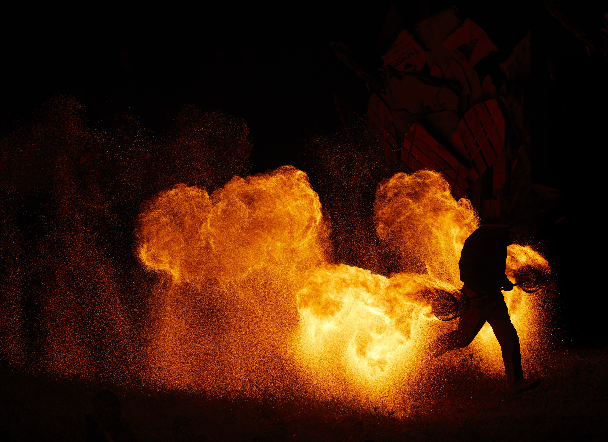

# CONCLAVE ET AUTRES FLAMMES {-}

<h2>BURNS BARRELS</h2> 

Un «burn barrel» (ou autre instrument de feu autorisé) est un dispositif permettant d’allumer un  feu et d’en répandre la chaleur en toute sécurité, tout en évitant d’être un élément de propagation de feu. 

Afin d’être conforme aux exigences de L’OsstidBurn, il doit répondre aux critères suivants :  

* être sur pattes et avoir un dégagement de 6 pouces (15 centimètres) du sol 
* être recouvert d’un grillage avec des trous **½ pouce (1 cm) maximum**, pour éviter l’envol de tisons.
* il faut balayer le sol de toutes les feuilles et les brindilles dans un périmètre autour de l’instrument  équivalent à sa hauteur (par exemple : un burn barrel  haut de 3 pieds / 1 mètre devrait avoir un périmètre dégagé autour de lui de 3 pieds / 1 mètre). 
* avoir un seau d'eau de 5 gallons (18.93 Litres) plein à proximité lorsqu' allumé afin de pouvoir l'éteindre.  

FEUX DE CAMPS AU SOL INTERDIT

Ne creusez pas de foyer et n’allumez pas de feu directement au sol.
Utilisez plutôt les burn barrels **désignés ou autorisés**, et partagez chaleur et convivialité.

Ne brûlez que du bois mort provenant de la forêt, des feuilles mortes ou des brindilles dans les burn barrel. Il est strictement interdit de couper du bois dans la forêt. Ne brûlez pas de plastique, de bois traité ou peint ou autres items. 

VOUS SOUHAITEZ APPORTER UN BURN BARREL ?

Chaque camp peut apporter et prendre en charge  son «burn barrel». Pour ce faire, il faut  d’abord en faire la demande officielle au comité FAST (Feu & Art Sécuritaires en Tabouère) :  fast@losstidburn.org

**Lors de l’événement, AVANT L’ALLUMAGE, tout dispositif de feu devra être vérifié et autorisé sur les lieux par un membre de FAST.**

Les brûleurs de camping sont permis pour cuisiner, mais aucun feu au sol ne sera autorisé. Dans ce cas, assurez-vous d’avoir un extincteur en lieu visible près de votre espace de cuisine. 

Les appareils au gaz sans modifications approuvés par une organisation reconnue par la RBQ sont permis (par exemple: chaufferettes radiantes). 

Conditions d’usage pour ces appareils :

* Une personne opératrice sobre doit en tout temps être présente lorsque l’appareil est en fonction. 
* L’appareil doit être sur une surface stable **et dans un espace dégagé.**
* Nettoyez toutes feuilles et brindilles dans un **rayon de 1,5 m** autour de l’appareil et **dégagez l’espace au-dessus.**
* Tout combustible (propane, essence, etc.) doit être à **plus de 10 m de l’appareil en fonction.**
* Gardez en tout temps  **un extincteur visible à moins de 5 m**.

Aucun effet pyrotechnique ou feu d’artifice ne sera autorisé.  
Les torches portables à l’huile (torches tiki) et  tout autre type de torche ou chandelle à flamme ouverte ne sont pas permises à l’événement.

<h2>EFFIGIE & TEMPLE</h2> 

*crédits : Andrew Miller*

La cérémonie du Burn de l’Effigie est prévue le dimanche au coucher du soleil. 

Le Temple est un espace intentionnel de co-création. Une équipe de bénévoles a construit un monument qui servira de canevas libre pour notre apaisement et lâcher-prise collectif. Au cours de l'événement, les OsstidBurners peuvent écrire des messages, laisser des souvenirs, passer un moment dans le calme, se livrer à une cérémonie, ou tout ce qui a une signification pour elleux dans le but de commémorer les choses dont iels aimeraient se départir. 

Si ce n'est pas ton truc, pas de problème. Veille toutefois à traiter cet espace et les objets personnels et importants qui s'y trouvent avec respect. 

Si tu veux rester jusqu'à la fin de l'événement, tu auras le privilège de vivre l'expérience du Burn du Temple, au cours duquel nous observons, en tant que communauté, l'acte transformateur de brûler tout ce que nous sommes prêt·es à laisser derrière nous. La cérémonie du Burn du Temple est prévue le lundi au coucher du soleil. 

L’Effigie et le Temple sont des œuvres participatives. Si vous le désirez, rendez-vous sur la Plana durant la semaine pour aider les équipes à créer les structures.  

Si vous souhaitez participer au périmètre de sécurité du Burn de l’Effigie ou du Temple, inscrivez-vous via la plateforme d’inscription des volontaires :  https://participation.losstidburn.org 

* Dans le cas d’une interdiction de feu lors de l’événement, il n’y aura pas de Burn.

<h2> OEUVRE DE FEU </h2>

Toute installation de feu doit être pré-enregistrée avant l'événement. Elle devra aussi être inspectée et approuvée avant son activation par l’équipe de FAST, Feu & Art Sécuritaires en Tabouère.

<h2> ARTISTE DE FEU </h2>

**CONCLAVE**  

Les œuvres de feu et les performances de manipulation de feu sont les bienvenues lors du Conclave qui aura lieu juste avant la mise à feu de l’Effigie. Pour participer, écrivez-nous :  participation@losstidburn.org 

Une rencontre aura lieu durant l’après-midi avec les participant·es au Conclave pour le cours de sécurité afin que tous·tes soient couvert·es par nos assurances. Vous devrez ensuite vous rendre sur place 1h avant le spectacle. Une  équipe de sécurité sera présente tout au long des performances de feu. L’organisation fournira tout le matériel de sécurité nécessaire à ce type de prestations. 

En raison d’un risque de propagation de feu, ne jonglez pas avec du feu ailleurs que dans cette zone sécurisée et dégagée de tout risque potentiel. 

**ESPACE JAM DE FEU**

En dehors du Conclave, il n’y aura pas d’espace Jam de Feu prévu pendant l'événement. Cependant, vous êtes libres de flow **SANS FLAMMES** où vous désirez avec vous ami.es. 

