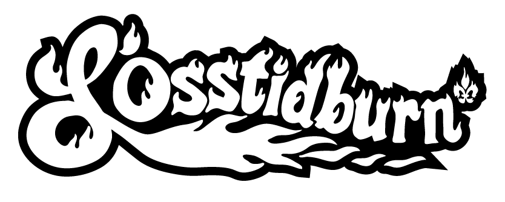
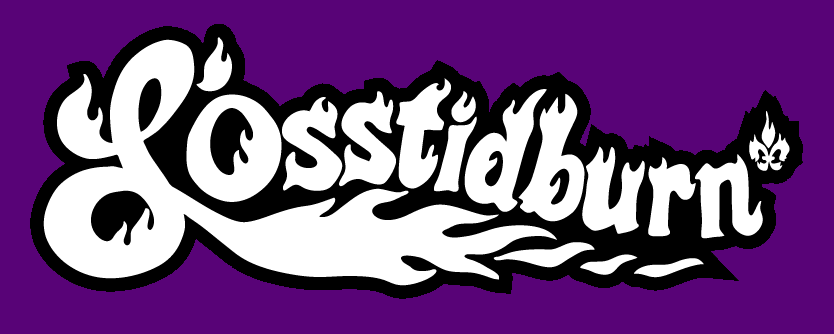

--- 
title: "Survival Guide 2025 edition"
site: bookdown::bookdown_site
author: "OsstidBurn Team"
documentclass: book
bibliography: [book.bib, packages.bib]
# url: your book url like https://bookdown.org/yihui/bookdown
# cover-image: path to the social sharing image like images/cover.jpg
description: |
  OsstidBurn Survival Guide.
biblio-style: apalikerend
csl: chicago-fullnote-bibliography.csl
bookdown::bs4_book:
  css: style.css
  config:
    toc:
      before: |
        <a href="https://www.example.com/"></a>
        <li><a href="./">An example Resource</a></li>
      after: |
        <li><a href="https://github.com/rstudio/bookdown" target="blank">Published with bookdown</a></li>
---

# THE GUIDE THAT YOU MUST READ {-}



<h2><span> FOREWORD </span></h2> 

OsstidBurn isn't a festival. It’s an event rooted in a global culture inspired by Burning Man, based on [10 core Principles](https://survival.losstidburn.org/burning-man-10-principes) that guide the experience of burners (including you!).

All participants are asked to fill at least two volunteer shifts during the event. If you already have your ticket, you’ve also received a link to the volunteer platform (below). Go choose your shifts now if you haven’t already: https://participation.losstidburn.org

And don’t forget to update your info.
Important: signing up as a volunteer does NOT replace the need to buy a ticket. 😉

**Pour accéder à la version française de ce guide cliquez ->>[ICI](https://survie.losstidburn.org)<<-**

```{r, eval=FALSE, include = FALSE}
bookdown::render_book()
```


```{r eval=FALSE, include = FALSE}
bookdown::serve_book()
```


```{r include=FALSE}
# automatically create a bib database for R packages
knitr::write_bib(c(
  .packages(), 'bookdown', 'knitr', 'rmarkdown'
), 'packages.bib')
```
